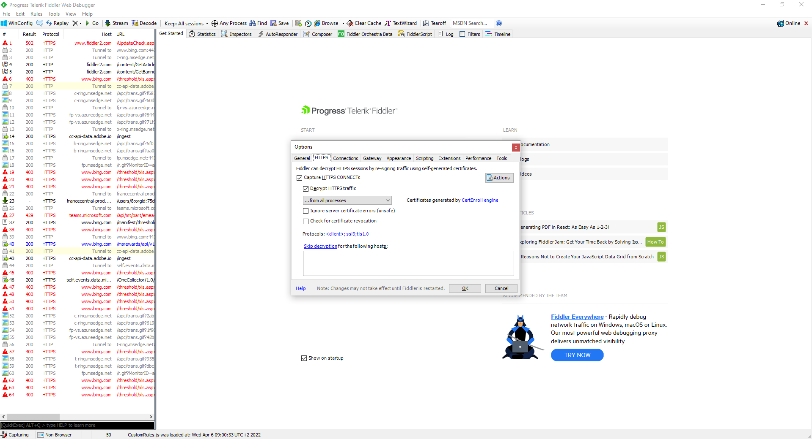

# ContractsApiClient
Documentum contracts signment API client
* The project was prepared for tracing via Fiddler.
* The Fiddler root certificate must be added to keystore
```
keytool.exe -import -file C:\Temp\FiddlerRoot.cer -keystore FiddlerKeystore -alias Fiddler
```
* JVM has to be configured with keys:
```
-DproxySet=true
-DproxyHost=127.0.0.1 
-DproxyPort=8888 
-Djavax.net.ssl.trustStore="C:\Program Files\Java\jre1.8.0_202\bin\FiddlerKeystore" 
-Djavax.net.ssl.trustStorePassword="123456"
```
* Fiddler has to be configured an in picture:

